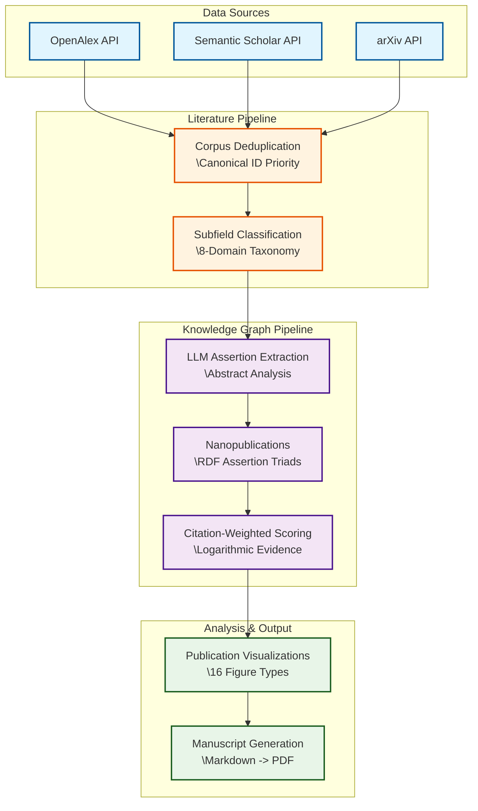

# Active Inference Meta-Analysis

> **Archive status:** This tree lives under `projects_archive/act_inf_metaanalysis/` in the template monorepo. It is preserved for inspection and standalone runs; it is not executed by `./run.sh` unless promoted to `projects/`.

**Repository:** [github.com/ActiveInferenceInstitute/act_inf_metaanalysis](https://github.com/ActiveInferenceInstitute/act_inf_metaanalysis)

**Current snapshot (2026-07-26):** PDF/HTML rendering and local artifact/package
validation pass; the publication gate remains fail-closed because the latest
resume-safe Semantic Scholar bulk probe returned HTTP 500 after bounded retries.
The existing 1,106-paper snapshot was preserved, so the package is reproducible
and reviewable but not source-complete for a new live publication.

**Current publication PDF:** [act_inf_metaanalysis_v2.0.6_2026-07-26.pdf](act_inf_metaanalysis_v2.0.6_2026-07-26.pdf). This date-stamped root artifact is the public release copy; `output/pdf/act_inf_metaanalysis_combined.pdf` remains the reproducible render output used by the pipeline.

[](https://github.com/ActiveInferenceInstitute/act_inf_metaanalysis/actions)
[](https://github.com/ActiveInferenceInstitute/act_inf_metaanalysis)
[](https://github.com/ActiveInferenceInstitute/act_inf_metaanalysis)
[](https://www.python.org/downloads/)
[](https://opensource.org/licenses/MIT)

> A computational meta-analysis of the **Active Inference** and **Free Energy Principle (FEP)** literature. Multi-source retrieval, LLM-based assertion extraction (nanopublications), citation-weighted hypothesis triage, and a rule-based reference-annotator agreement check map the field's evidence landscape—scores indicate evidence mapping, not scientific confirmation.

---

## 🎯 What This Project Does

This repository houses the entire data pipeline, source code, and manuscript generation logic to empirically analyze the growth and structure of Active Inference research.

- ✅ **Automated Literature Mining:** Interrogates arXiv, Semantic Scholar, and OpenAlex.
- ✅ **Knowledge Graph Construction:** Serializes LLM-extracted assertions into RDF-compatible semantic triads.
- ✅ **Hypothesis Triage:** Citation-weighted evidence mapping for 8 core structural claims (not confirmation).
- ✅ **Advanced Visualization:** Generates publication-ready growth curves, PCA embeddings, term heatmaps, and citation networks using a colorblind-safe palette.

---

## 🗺️ System Architecture

The pipeline follows a highly modular, decoupled architecture routing raw literature data through an extraction and analysis pipeline into visualization and manuscript generation.



---

## 🚀 Quick Start

Use `uv` for dependencies. In the **template monorepo**, this project lives at `projects_archive/act_inf_metaanalysis/` and is **not** discovered by `./run.sh` (archive-only).

### Running tests

Use `uv` for dependency management. From **within the project directory** (ensures correct venv context):

```bash
cd projects_archive/act_inf_metaanalysis
uv sync --extra dev  # First time only: install dependencies
uv run pytest --cov=src --cov-fail-under=90 -v
```

From the **repository root**, pass the project path explicitly:

```bash
uv run pytest projects_archive/act_inf_metaanalysis/tests/ --cov=projects_archive/act_inf_metaanalysis/src --cov-fail-under=90
```

**Important:** The full test suite requires `rdflib`, `wordcloud`, and `scikit-learn` to be installed.
If any of these are missing, pytest will abort with a clear error listing the missing packages.

Example single module:

```bash
cd projects_archive/act_inf_metaanalysis
uv run pytest tests/knowledge_graph/test_hypothesis.py -v
```

### Running the orchestration scripts

Thin orchestrators live under `scripts/`:

```bash
cd projects_archive/act_inf_metaanalysis
# 1. Literature search (multi-source; default merges into existing corpus — use --no-resume to ignore it)
python3 scripts/01_literature_search.py --log-level INFO

# 2. Meta-analysis processing
python3 scripts/02_meta_analysis_pipeline.py --log-level DEBUG

# 3. Build & evaluate the knowledge graph
python3 scripts/03_build_knowledge_graph.py

# 4. Render all manuscript figures
python3 scripts/04_generate_figures.py --dpi 300

# 5. Hydrate manuscript variables through the template-recognized entrypoint
python3 scripts/z_generate_manuscript_variables.py --project .

# 6. Audit full-text availability across the corpus
python3 scripts/06_fulltext_assessment.py

# 7. (Validation / QA — optional) Rule-based reference-annotator agreement study.
#    Deterministic reproducibility floor, NOT a human validation. Not part of the
#    core content-generation chain; run after 03 has produced nanopublications.
python3 scripts/07_run_validation_study.py --sample-fraction 0.10 --min-size 200

# 8–9. Validate cross-artifact consistency and write the pipeline manifest
python3 scripts/08_validate_artifacts.py
python3 scripts/09_write_pipeline_manifest.py
python3 scripts/11_prepare_evidence_pilots.py
python3 scripts/12_snapshot_output.py
python3 scripts/13_verify_tooling_inventory.py
python3 scripts/10_release_preflight.py
python3 scripts/14_verify_release_package.py
```

If extraction is interrupted, rerun Stage 3 with the same config and without
`--clear-assertions`. Checkpointed paper IDs are skipped and the original
extraction `run_id` is preserved; `output/data/extraction_state.json` records
whether the run is resumable or complete.

Steps 1–5 are the content-generation chain; steps 6–9 provide full-text QA, deterministic validation, cross-artifact validation, and the initial manifest. Steps 11–13 prepare review queues, snapshots, and tooling-source evidence before Stage 10 runs the release preflight and refreshes the final manifest. Stage 14 verifies the staged release package. See [`doc/scripts.md`](doc/scripts.md) for each script's full flag reference.

---

## Archive layout

In the template monorepo, this tree is symlinked at `projects_archive/act_inf_metaanalysis/` (typically pointing at a local template workspace). It is **not** discovered by `./run.sh` unless promoted to `projects/`.

A nested `.git/` directory may be present from standalone repository history; the template monorepo uses the symlink as the working copy. Do not commit pre-populated `output/` when re-promoting.

---

## 🏗️ Directory Structure

```text
projects_archive/act_inf_metaanalysis/
├── act_inf_metaanalysis_v2.0.6_2026-07-26.pdf  # date-stamped publication artifact
├── src/                        # Core library (literature, analysis, knowledge_graph, visualization)
├── tests/                      # Pytest suite; 90% coverage gate in pyproject.toml
├── scripts/                    # Numbered orchestrators (01–14) plus canonical hydration
├── manuscript/                 # Markdown sections, config.yaml, references.bib
└── doc/                        # Architecture, API, data formats, scripts
```

---

## 🔬 Core Methodologies

### 1. Literature & Subfield Classification (`src/literature/`, `src/analysis/`)

Downloads are merged leveraging a cascading priority canonical ID check (DOI > arXiv > Semantic Scholar > OpenAlex > Title Hash). Extracted papers are passed through a deterministic, token-boundary-aware classification system routing them into heavily customized taxonomy containing *Domain A* (Core Theory), *Domain B* (Tools), and *Domain C* (Applications: Neuroscience, Robotics, Language, Psychiatry, Biology).

### 2. RDF-Enriched Nanopublications (`src/knowledge_graph/`)

At the core of the extraction pipeline is an automated system assigning each abstract one or more rigorous structured metadata attributes. Each valid *Assertion* asserts evidence either `<supports>`, `<contradicts>`, or remains `<neutral>` against 8 established empirical FEP Hypotheses, persisting to JSONL via a graceful `networkx` fallback `rdflib` semantic model.

### 3. Hypothesis Scoring

To weigh the literature equitably, raw assertions are normalized and transformed with a citation-weighting mechanism. A logarithmic dampener ensures that highly cited foundational papers mathematically inform consensus, without permitting hyper-cited singular papers (e.g. Friston 2010) to eclipse the emerging consensus from newly published subdomains.

### 4. Cohesive Aesthetics (`src/visualization/`)

Visualization outputs utilize a central, heavily customized `style.py` module implementing a strict colorblind-safe categorical scheme, centralized font standardization (ensuring PDF LaTeX compilation consistency), spacing ratios, and custom 3-degree polynomial smoothed distributions for clean, publisher-ready asset generation.

---

## 📚 Further Reading

Looking to dive deeper? Check out the comprehensive documentation hubs:

- **[Architecture Guide](doc/architecture.md)** — In-depth overview of the data pipeline and module definitions.
- **[Data Formats](doc/data_formats.md)** — Schema definitions for Corpus mapping, RDF serializations, and outputs.
- **[Project Agents](AGENTS.md)** — Operational metadata and configuration requirements for this distinct subproject.
- **[Documentation Hub](doc/README.md)** — Project-level quick start and advanced pipeline flags.
- **[Project TODO](TODO.md)** — Authoritative forward backlog for minor and medium work, with acceptance gates.
- **[AI Meta-Analysis Playbook](doc/ai_meta_analysis_playbook.md)** — Reproducible stage-by-stage operating procedure.

*Note: The project applies an automated documentation parity standard constraint. Every underlying module inside `src/` and `tests/` features dedicated component-level `README.md` and `AGENTS.md` files mapping code functionality tightly to logic constraints.*

*This project was developed within the Docxology research infrastructure.*

## 📋 Changelog

The canonical, continuously updated changelog lives in **[CHANGELOG.md](CHANGELOG.md)** — treat it as the single source of truth. (An earlier copy was duplicated here and drifted several releases behind; this section is intentionally kept to a short pointer to avoid that recurring.)

**Current release: v2.0.6 (2026-07-26 closure)** — adds configuration-driven live-refresh provenance, partial-year-safe temporal statistics, topic stability diagnostics, cross-artifact validation, canonical manuscript hydration, external tooling verification, and PDF/HTML-only render closure while preserving the honest rule-based validation boundary. The current working tree adds Semantic Scholar retrieval hardening and canonical public-repository metadata; the latest gate has 659 passed tests, 1 skipped, and 90.04% coverage against the 90% gate.

See **[CHANGELOG.md](CHANGELOG.md)** for the full per-release history (v2.0.0 → v2.0.6).

---
