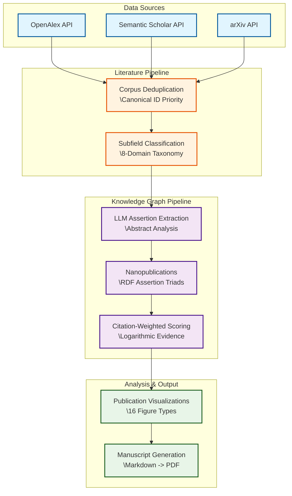

# 🧠 Active Inference Meta-Analysis

[](https://github.com/docxology/act_inf_metaanalysis/actions)
[](https://github.com/docxology/act_inf_metaanalysis)
[](https://github.com/docxology/act_inf_metaanalysis)
[](https://www.python.org/downloads/)
[](https://opensource.org/licenses/MIT)

> A computational meta-analysis of the **Active Inference** and **Free Energy Principle (FEP)** literature. This project employs multi-source retrieval, LLM-based assertion extraction (Nanopublications), probabilistic knowledge graphs, and citation-weighted hypothesis scoring to map the structural and thematic trajectory of the field.

---

## 🎯 What This Project Does

This repository houses the entire data pipeline, source code, and manuscript generation logic to empirically analyze the growth and structure of Active Inference research.

- ✅ **Automated Literature Mining:** Interrogates arXiv, Semantic Scholar, and OpenAlex.
- ✅ **Knowledge Graph Construction:** Serializes LLM-extracted assertions into RDF-compatible semantic triads.
- ✅ **Hypothesis Scoring:** Evaluates the temporal evidence for 8 core structural claims in the literature.
- ✅ **Advanced Visualization:** Generates publication-ready growth curves, PCA embeddings, term heatmaps, and citation networks using a colorblind-safe palette.

---

## 🗺️ System Architecture

The pipeline follows a highly modular, decoupled architecture routing raw literature data through an extraction and analysis pipeline into visualization and manuscript generation.



---

## 🚀 Quick Start

Ensure you have your environment set up and dependencies installed (we use `uv` for python dependency tracking). Because this project adheres to a standalone **Graduated Pattern**, all scripts and tests are executed locally relative to the project root.

### Running Tests 🧪

The repository is built applying strictly test-driven methodologies with zero-mock pure functions where possible.

```bash
# Full test suite with coverage
uv run pytest tests/ --cov=src --cov-fail-under=90 -v

# Single test file specifically
uv run pytest tests/test_hypothesis.py -v
```

### Running the Orchestration Scripts ⚙️

The core logic is thin-orchestrated via the `scripts/` directory:

```bash
# 1. Literature search (multi-source, resumable)
python3 scripts/01_literature_search.py --resume --log-level INFO

# 2. Meta-analysis processing
python3 scripts/02_meta_analysis_pipeline.py --log-level DEBUG

# 3. Build & evaluate the knowledge graph
python3 scripts/03_build_knowledge_graph.py

# 4. Render all manuscript figures
python3 scripts/04_generate_figures.py --dpi 300
```

---

## 🏗️ Directory Structure

```text
act_inf_metaanalysis/
├── src/                        # 🧠 Core scientific library (45+ public APIs)
│   ├── literature/             # Multi-source retrieval and corpus management
│   ├── analysis/               # Temporal, TF-IDF, Topic Modeling, Citation graphs
│   ├── knowledge_graph/        # RDF structures, Nanopublication logic, Hypothesis scoring
│   └── visualization/          # 16 standard figure generators, VIZ_CONFIG aesthetic defaults
├── tests/                      # 🧪 534 rigorous tests achieving ≥90% project coverage
├── scripts/                    # ⚙️ Execution orchestrators 
├── manuscript/                 # 📝 Markdown manuscript sections, References, and config
└── doc/                        # 📚 Advanced API documentation, Architecture specs, Data formats
```

---

## 🔬 Core Methodologies

### 1. Literature & Subfield Classification (`src/literature/`, `src/analysis/`)

Downloads are merged leveraging a cascading priority canonical ID check (DOI > arXiv > Semantic Scholar > OpenAlex > Title Hash). Extracted papers are passed through a deterministic, token-boundary-aware classification system routing them into heavily customized taxonomy containing *Domain A* (Core Theory), *Domain B* (Tools), and *Domain C* (Applications: Neuroscience, Robotics, Language, Psychiatry, Biology).

### 2. RDF-Enriched Nanopublications (`src/knowledge_graph/`)

At the core of the extraction pipeline is an automated system assigning each abstract one or more rigorous structured metadata attributes. Each valid *Assertion* asserts evidence either `<supports>`, `<contradicts>`, or remains `<neutral>` against 8 established empirical FEP Hypotheses, persisting to JSONL via a graceful `networkx` fallback `rdflib` semantic model.

### 3. Hypothesis Scoring

To weigh the literature equitably, raw assertions are normalized and transformed with a citation-weighting mechanism. A logarithmic dampener ensures that highly cited foundational papers mathematically inform consensus, without permitting hyper-cited singular papers (e.g. Friston 2010) to eclipse the emerging consensus from newly published subdomains.

### 4. Cohesive Aesthetics (`src/visualization/`)

Visualization outputs utilize a central, heavily customized `style.py` module implementing a strict colorblind-safe categorical scheme, centralized font standardization (ensuring PDF LaTeX compilation consistency), spacing ratios, and custom 3-degree polynomial smoothed distributions for clean, publisher-ready asset generation.

---

## 📚 Further Reading

Looking to dive deeper? Check out the comprehensive documentation hubs:

- **[Architecture Guide](doc/architecture.md)** — In-depth overview of the data pipeline and module definitions.
- **[Data Formats](doc/data_formats.md)** — Schema definitions for Corpus mapping, RDF serializations, and outputs.
- **[Project Agents](AGENTS.md)** — Operational metadata and configuration requirements for this distinct subproject.

*This project was developed within the Docxology research infrastructure.*
