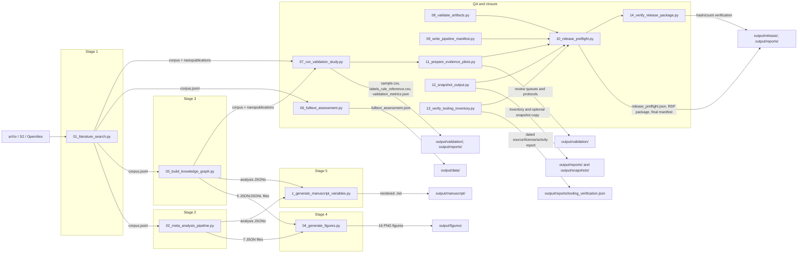

# Active Inference Meta-Analysis — Documentation

**Paper:** *A Living Literature Review Architecture for Active Inference: Scalable Assertion Extraction, Nanopublications, and Citation-Weighted Hypothesis Scoring*

**Package / upstream reference:** [github.com/ActiveInferenceInstitute/act_inf_metaanalysis](https://github.com/ActiveInferenceInstitute/act_inf_metaanalysis)

**Current publication PDF:** [act_inf_metaanalysis_v2.0.6_2026-07-26.pdf](../act_inf_metaanalysis_v2.0.6_2026-07-26.pdf). The root PDF is the dated public release copy; `output/pdf/act_inf_metaanalysis_combined.pdf` is the reproducible pipeline render.

**Template monorepo path:** `projects_archive/act_inf_metaanalysis/` (archived; not pipeline-discovered).

Project-level documentation for the `act_inf_metaanalysis` pipeline.

The complete generated `output/` tree is versioned in the public repository for
reproducibility. It contains the current data, 16 figures, hydrated manuscript,
HTML/PDF renders, reports, validation records, release package, and dated
snapshots. Local environments and caches remain excluded by `.gitignore`.

> See [AGENTS.md](AGENTS.md) for doc-hub architectural conventions, [../AGENTS.md](../AGENTS.md) for project-wide contributor properties, and the [project README](../README.md) for setup and overview.

The authoritative forward backlog is the [project-level TODO](../TODO.md). It
contains only scoped minor and medium work; each item has dependencies and an
acceptance gate.

---

## Central Philosophy: Reproducible Generative Research

This pipeline rejects ad-hoc analysis in favor of **Reproducible Generative Research**. It is built from **13 numbered scripts** (01–04, 06–14) plus the canonical manuscript hydrator: retrieval, analysis, extraction, figures, hydration, full-text QA, deterministic validation, cross-artifact validation, manifest closure, review-queue preparation, safe snapshot inventory, tooling-source verification, release preflight, and release-package verification. By structuring the literature review this way, this platform ensures:

1. **Verifiable Provenance**: Every paper, classification, and assertion is strictly mapped from public APIs (arXiv, Semantic Scholar, and OpenAlex) through atomic JSONL intermediate states into the final visual output.
2. **Robust Extensibility**: New papers incrementally stream into the corpus, and new LLM models can instantly backfill metadata assessments via checkpointed resumes.
3. **Artifact Duality**: Project documentation adheres to strict constraints, requiring human-readable `README.md` and semantic subagent parameters in `AGENTS.md` for every single module.

---

## Onboarding Path for Researchers

If you are joining the Active Inference Institute to extend this pipeline, you should consume the documentation hub in the following order:

1. **[architecture.md](architecture.md)** — Understand the 5-stage core data flow (plus the QA/closure scripts 06–14) and why we enforce a "Thin Orchestrator" scripting pattern.
2. **[data_formats.md](data_formats.md)** — Internalize the schemas (especially JSONL/TriG) that form the nervous system between modules.
3. **[scripts.md](scripts.md)** — Learn how to execute, pause, configure, and troubleshoot the pipeline from the command line.
4. **[hypotheses.md](hypotheses.md)** — Understand the theoretical domain bounds and the mathematical formulation of our citation-weighted scoring logic.
5. **[ai_meta_analysis_playbook.md](ai_meta_analysis_playbook.md)** — Follow the complete reproducible operating procedure and recovery paths.
6. **[../TODO.md](../TODO.md)** — Review the forward minor/medium backlog and acceptance gates.

---

## Quick Start

```bash
# From the project root (projects_archive/act_inf_metaanalysis/ in the monorepo,
# or the repository root in a standalone clone)

# Core content-generation chain (run in order):
uv run python scripts/01_literature_search.py --config manuscript/config.yaml
uv run python scripts/02_meta_analysis_pipeline.py
uv run python scripts/03_build_knowledge_graph.py --config manuscript/config.yaml
uv run python scripts/04_generate_figures.py
uv run python scripts/z_generate_manuscript_variables.py --project .

# QA and closure scripts (run after the content chain):
uv run python scripts/06_fulltext_assessment.py
uv run python scripts/07_run_validation_study.py --sample-fraction 0.10 --min-size 200
uv run python scripts/08_validate_artifacts.py
uv run python scripts/09_write_pipeline_manifest.py
uv run python scripts/11_prepare_evidence_pilots.py
uv run python scripts/12_snapshot_output.py
uv run python scripts/13_verify_tooling_inventory.py
uv run python scripts/10_release_preflight.py
uv run python scripts/14_verify_release_package.py
```

---

## Pipeline Overview



| Stage | Script | Key Inputs | Key Outputs |
| --- | --- | --- | --- |
| 1. Literature Search | `01_literature_search.py` | API access, config.yaml | `corpus.jsonl` |
| 2. Meta-Analysis | `02_meta_analysis_pipeline.py` | `corpus.jsonl` | `subfield_classification.json`, `temporal_analysis.json`, `tfidf_data.json`, `topics.json`, `citation_network.json`, `citation_graph.gml`, `subfield_timeline.json` |
| 3. Knowledge Graph | `03_build_knowledge_graph.py` | `corpus.jsonl`, Ollama LLM | `nanopublications.jsonl`, `nanopublications.trig`, `hypothesis_scores.json`, `hypothesis_trends.json`, `assertion_summary.json` |
| 4. Visualization | `04_generate_figures.py` | All Stage 2+3 outputs | 16 PNG figures in `output/figures/` |
| 5. Variable Hydration | `z_generate_manuscript_variables.py` | All Stage 2+3 outputs | Rendered manuscript in `output/manuscript/`, `output/data/manuscript_variables.json` |
| 6. Full-Text Assessment | `06_fulltext_assessment.py` | `corpus.jsonl` | `output/data/fulltext_assessment.json` |
| 7. Validation Study | `07_run_validation_study.py` | `corpus.jsonl`, `nanopublications.jsonl` | `output/validation/sample.csv`, `output/validation/labels_rule_reference.csv`, `output/reports/validation_metrics.json` |
| 8. Artifact Contract | `08_validate_artifacts.py` | All current artifacts | `output/reports/artifact_contract.json` |
| 9. Pipeline Manifest | `09_write_pipeline_manifest.py` | Inputs, outputs, versions, gates | `output/reports/pipeline_manifest.json` |
| 10. Release Preflight | `10_release_preflight.py` | Current artifacts, render outputs, tests, tooling gate | `output/reports/release_preflight.json`, `output/release/` |
| 11. Evidence Pilots | `11_prepare_evidence_pilots.py` | Corpus, validation sample | Review queues, protocols, pilot manifest |
| 12. Snapshot Inventory | `12_snapshot_output.py` | Current output tree | Inventory and optional non-overwriting snapshot |
| 13. Tooling Verification | `13_verify_tooling_inventory.py` | Retained tooling registry, public sources | `output/reports/tooling_verification.json` |
| 14. Release Package Verification | `14_verify_release_package.py` | Staged nanopublication package | `output/reports/release_package_verification.json` |

*Stage 7 is a deterministic **rule-based reference-annotator agreement** study (a reproducibility floor), **not** a human validation. Stages 8 and 9 close the cross-artifact and provenance gates; Stages 11–13 prepare the remaining release inputs, Stage 10 runs the fail-closed release gate and refreshes the final manifest, and Stage 14 verifies the package.*

---

## Configuration

The pipeline reads settings from `manuscript/config.yaml`. CLI flags override config values.

**Priority:** CLI flags > config.yaml > script defaults

| Section | Key | Default | Description |
| --- | --- | --- | --- |
| `search` | `query` | `"active inference free energy principle"` | Search query for all APIs |
| `search` | `max_results` | `1000` | Max results per source |
| `search` | `resume` | `true` | Merge with existing corpus |
| `search` | `clear_corpus` | `false` | Delete corpus before searching |
| `search` | `arxiv_queries` | (5 default queries) | Override arXiv multi-query list |
| `search` | `relevance_keywords` | (10 default keywords) | Override relevance filter keyword list |
| `knowledge_graph` | `checkpoint_interval` | `25` | Flush nanopubs every N papers |
| `knowledge_graph` | `clear_assertions` | `false` | Delete nanopubs and restart |
| `knowledge_graph` | `max_papers` | `null` | Limit papers for LLM (null = all) |
| `hypothesis_definitions` | `H1`..`H8` | (8 standard) | Custom hypothesis names and descriptions |
| `subfield_keywords` | `A1_formal`..`C5_biology` | (8 domains) | Override domain classification keywords |

---

## Output Files

| File | Stage | Format | Description |
| --- | --- | --- | --- |
| `corpus.jsonl` | 1 | JSON Lines | Deduplicated papers (15 fields per record) |
| `subfield_classification.json` | 2 | JSON | Domain → paper count mapping |
| `subfield_timeline.json` | 2 | JSON | Domain → {year → count} nested mapping |
| `temporal_analysis.json` | 2 | JSON | Year counts, cumulative, CAGR, peak year, doubling time |
| `tfidf_data.json` | 2 | JSON | TF-IDF matrix, feature names, domain labels, tokenized docs |
| `topics.json` | 2 | JSON | NMF topics (top-10 words + weights per topic) |
| `citation_network.json` | 2 | JSON | Network metrics: nodes, edges, density, PageRank top-5, HITS top-5 |
| `citation_graph.gml` | 2 | GML | Full NetworkX directed graph |
| `nanopublications.jsonl` | 3 | JSON Lines | LLM-extracted assertions with provenance |
| `hypothesis_scores.json` | 3 | JSON | Citation-weighted scores per hypothesis `[-1, 1]` |
| `hypothesis_trends.json` | 3 | JSON | Year-by-year cumulative hypothesis scores |
| `assertion_summary.json` | 3 | JSON | Total assertions, type counts, per-hypothesis breakdown |
| `nanopublications.trig` | 3 | RDF/TriG | Nanopub.net-compliant RDF export (four named graphs per nanopub) |
| `figures/*.png` | 4 | PNG | 16 publication-quality visualizations (300 DPI, ≥16pt fonts) |
| `manuscript/*.md` | 5 | Markdown | Rendered sections with `{{VAR}}` placeholders replaced |

---

## Manuscript Navigation

| Section file | Key figures generated | Key `{{VAR}}` injected | Source script |
| --- | --- | --- | --- |
| `00_abstract.md` | — | `CORPUS_SIZE`, `CAGR_PCT`, `YEAR_START`, `YEAR_END`, `CITATION_EDGES`, `CITATION_RESOLUTION_PCT` | Stage 5 |
| `03a_results_field_overview.md` | `field_summary.png`, `subfield_distribution.png`, `growth_curve.png`, `subfield_timeline.png` | `A1_COUNT`…`C5_PCT`, `PEAK_YEAR`, `CAGR_PCT` | Stage 2 + 5 |
| `03_results_hypothesis.md` | `hypothesis_dashboard.png`, `evidence_timeline.png`, `assertion_breakdown.png`, `assertion_summary.png` | `H1_SCORE`…`H8_SCORE`, `TOTAL_ASSERTIONS` | Stage 3 + 5 |
| `03c_results_text_analytics.md` | `word_cloud.png`, `pca_embeddings.png`, `term_heatmap.png`, `dendrogram.png`, `topic_term_bars.png`, `cooccurrence_matrix.png` | `NUM_TOPICS`, `NUM_VOCAB_FEATURES` | Stage 2 + 5 |
| `03d_results_citation_network.md` | `citation_network.png`, `degree_distribution.png` | `CITATION_NODES`, `CITATION_EDGES`, `CITATION_DENSITY_PCT` | Stage 2 + 5 |

Variable hydration is handled by `src/manuscript/variables.py`, invoked by the canonical `scripts/z_generate_manuscript_variables.py` entrypoint. See `manuscript/README.md` for the full variable-to-source mapping.

---

## Incremental Resume

| Feature | CLI Flag | Config Key | Effect |
| --- | --- | --- | --- |
| Corpus resume | `--resume` (default on) | `search.resume` | Loads existing corpus, fetches only new papers |
| Clear corpus | `--clear-corpus` | `search.clear_corpus` | Rebuilds corpus from scratch |
| LLM resume | *(automatic)* | *(always on)* | Reads `nanopublications.jsonl`, skips processed papers |
| Clear assertions | `--clear-assertions` | `knowledge_graph.clear_assertions` | Deletes nanopubs, re-extracts all |
| Max papers limit | `--max-papers N` | `knowledge_graph.max_papers` | Process at most N papers via LLM |

---

## Documentation Index

| Document | Scope |
| --- | --- |
| [architecture.md](architecture.md) | Pipeline design, module dependency graph, data flow |
| [scripts.md](scripts.md) | Per-script CLI reference with all flags, YAML keys, and examples |
| [api_reference.md](api_reference.md) | Module-level API documentation (all 5 packages, 25 module sections) |
| [data_formats.md](data_formats.md) | Output file schemas and field documentation |
| [hypotheses.md](hypotheses.md) | Hypothesis definitions, scoring formula, and LLM prompt |
| [visualization_guide.md](visualization_guide.md) | All 16 figure types with source data and rendering details |
| [ai_meta_analysis_playbook.md](ai_meta_analysis_playbook.md) | Stage-by-stage reproducible operating procedure and recovery rules |
| [tooling_inventory.yaml](tooling_inventory.yaml) | Source registry for the publication-facing tooling table |
| [testing.md](testing.md) | Test architecture, latest 687-pass gate, and coverage configuration |
| [CODE_QUALITY_AUDIT.md](CODE_QUALITY_AUDIT.md) | Thermo-nuclear maintainability audit (2026-05-24) |
