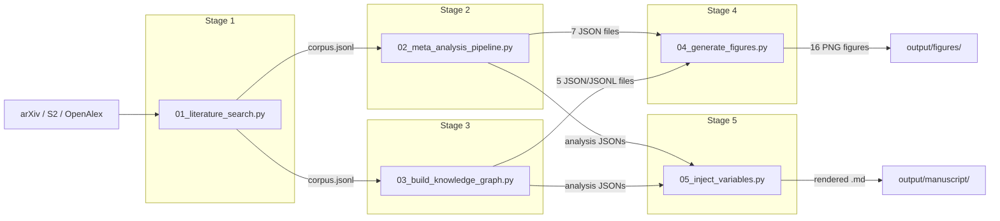

# Active Inference Meta-Analysis — Documentation

**Paper:** *A Living Literature Review Architecture for Active Inference: Scalable Assertion Extraction, Nanopublications, and Citation-Weighted Hypothesis Scoring*

**Standalone private repository:** [github.com/docxology/act_inf_metaanalysis](https://github.com/docxology/act_inf_metaanalysis)

Project-level documentation for the `act_inf_metaanalysis` pipeline.

> See [AGENTS.md](../AGENTS.md) for contributor and AI-agent conventions, and the [project README](../README.md) for setup and overview.

---

## Quick Start

```bash
# From the project root (projects/act_inf_metaanalysis/)
python scripts/01_literature_search.py --config manuscript/config.yaml
python scripts/02_meta_analysis_pipeline.py
python scripts/03_build_knowledge_graph.py --config manuscript/config.yaml
python scripts/04_generate_figures.py
python scripts/05_inject_variables.py
```

---

## Pipeline Overview



| Stage | Script | Key Inputs | Key Outputs |
| --- | --- | --- | --- |
| 1. Literature Search | `01_literature_search.py` | API access, config.yaml | `corpus.jsonl` |
| 2. Meta-Analysis | `02_meta_analysis_pipeline.py` | `corpus.jsonl` | `subfield_classification.json`, `temporal_analysis.json`, `tfidf_data.json`, `topics.json`, `citation_network.json`, `citation_graph.gml`, `subfield_timeline.json` |
| 3. Knowledge Graph | `03_build_knowledge_graph.py` | `corpus.jsonl`, Ollama LLM | `nanopublications.jsonl`, `nanopublications.trig`, `hypothesis_scores.json`, `hypothesis_trends.json`, `assertion_summary.json` |
| 4. Visualization | `04_generate_figures.py` | All Stage 2+3 outputs | 16 PNG figures in `output/figures/` |
| 5. Variable Injection | `05_inject_variables.py` | All Stage 2+3 outputs | Rendered manuscript in `output/manuscript/` |

---

## Configuration

The pipeline reads settings from `manuscript/config.yaml`. CLI flags override config values.

**Priority:** CLI flags > config.yaml > script defaults

| Section | Key | Default | Description |
| --- | --- | --- | --- |
| `search` | `query` | `"active inference free energy principle"` | Search query for all APIs |
| `search` | `max_results` | `1000` | Max results per source |
| `search` | `resume` | `true` | Merge with existing corpus |
| `search` | `clear_corpus` | `false` | Delete corpus before searching |
| `search` | `arxiv_queries` | (5 default queries) | Override arXiv multi-query list |
| `search` | `relevance_keywords` | (10 default keywords) | Override relevance filter keyword list |
| `knowledge_graph` | `checkpoint_interval` | `50` | Flush nanopubs every N papers |
| `knowledge_graph` | `clear_assertions` | `false` | Delete nanopubs and restart |
| `knowledge_graph` | `max_papers` | `null` | Limit papers for LLM (null = all) |
| `hypothesis_definitions` | `H1`..`H8` | (8 standard) | Custom hypothesis names and descriptions |
| `subfield_keywords` | `A1_formal`..`C5_biology` | (8 domains) | Override domain classification keywords |

---

## Output Files

| File | Stage | Format | Description |
| --- | --- | --- | --- |
| `corpus.jsonl` | 1 | JSON Lines | Deduplicated papers (12 fields per record) |
| `subfield_classification.json` | 2 | JSON | Domain → paper count mapping |
| `subfield_timeline.json` | 2 | JSON | Domain → {year → count} nested mapping |
| `temporal_analysis.json` | 2 | JSON | Year counts, cumulative, CAGR, peak year, doubling time |
| `tfidf_data.json` | 2 | JSON | TF-IDF matrix, feature names, domain labels, tokenized docs |
| `topics.json` | 2 | JSON | NMF topics (top-10 words + weights per topic) |
| `citation_network.json` | 2 | JSON | Network metrics: nodes, edges, density, PageRank top-5, HITS top-5 |
| `citation_graph.gml` | 2 | GML | Full NetworkX directed graph |
| `nanopublications.jsonl` | 3 | JSON Lines | LLM-extracted assertions with provenance |
| `hypothesis_scores.json` | 3 | JSON | Citation-weighted scores per hypothesis `[-1, 1]` |
| `hypothesis_trends.json` | 3 | JSON | Year-by-year cumulative hypothesis scores |
| `assertion_summary.json` | 3 | JSON | Total assertions, type counts, per-hypothesis breakdown |

---

## Incremental Resume

| Feature | CLI Flag | Config Key | Effect |
| --- | --- | --- | --- |
| Corpus resume | `--resume` (default on) | `search.resume` | Loads existing corpus, fetches only new papers |
| Clear corpus | `--clear-corpus` | `search.clear_corpus` | Rebuilds corpus from scratch |
| LLM resume | *(automatic)* | *(always on)* | Reads `nanopublications.jsonl`, skips processed papers |
| Clear assertions | `--clear-assertions` | `knowledge_graph.clear_assertions` | Deletes nanopubs, re-extracts all |
| Max papers limit | `--max-papers N` | `knowledge_graph.max_papers` | Process at most N papers via LLM |

---

## Documentation Index

| Document | Scope |
| --- | --- |
| [architecture.md](architecture.md) | Pipeline design, module dependency graph, data flow |
| [scripts.md](scripts.md) | Per-script CLI reference with all flags, YAML keys, and examples |
| [api_reference.md](api_reference.md) | Module-level API documentation (all 5 packages, 22 modules) |
| [data_formats.md](data_formats.md) | Output file schemas and field documentation |
| [hypotheses.md](hypotheses.md) | Hypothesis definitions, scoring formula, and LLM prompt |
| [visualization_guide.md](visualization_guide.md) | All 16 figure types with source data and rendering details |
| [testing.md](testing.md) | Test architecture, 534 tests across 25 files, coverage configuration |
