# Architecture

**Repository:** [github.com/ActiveInferenceInstitute/act_inf_metaanalysis](https://github.com/ActiveInferenceInstitute/act_inf_metaanalysis)

## Data Flow

The pipeline operates in five stages, each producing intermediate artifacts consumed by subsequent stages.

```text
Stage 1: Literature Search
──────────────────────────
  arXiv Atom API ──┐  (9 queries: 5 core AIF + 4 EBM-adjacent)
  Semantic Scholar ─┼──▶ Corpus (JSONL)  N papers (2005–present); see latest output/data/temporal_analysis.json
  OpenAlex API ────┘      │
      dedup via canonical ID priority
      (DOI > arXiv > S2 > OpenAlex > title hash)

Stage 2: Meta-Analysis
──────────────────────
  Corpus ──▶ Domain Classification (8 domains in A/B/C hierarchy, keyword matching)
         ──▶ Temporal Metrics (annual counts, CAGR, doubling time)
         ──▶ TF-IDF Matrix ──▶ NMF Topics
         ──▶ Citation Network (DiGraph) ──▶ PageRank, HITS, Communities

Stage 3: Knowledge Graph
────────────────────────
  Corpus ──▶ LLM Extraction ──▶ Assertions (paper, hypothesis, direction, confidence)
         ──▶ Nanopublications (assertion + provenance)
         ──▶ KnowledgeGraph (RDF triples or networkx fallback)
         ──▶ Hypothesis Scores (citation-weighted, [-1, 1])
         ──▶ Temporal Trends (cumulative score per year)
         ──▶ nanopublications.trig (RDF/TriG export for semantic web)

Stage 4: Visualization
──────────────────────
  Analysis JSON ──▶ field_summary.png
                ──▶ subfield_distribution.png
                ──▶ growth_curve.png
                ──▶ subfield_timeline.png
  Network data  ──▶ citation_network.png
                ──▶ degree_distribution.png
  KG scores     ──▶ hypothesis_dashboard.png
                ──▶ evidence_timeline.png
  TF-IDF data   ──▶ word_cloud.png
                ──▶ pca_embeddings.png
                ──▶ term_heatmap.png
                ──▶ dendrogram.png
  NMF topics    ──▶ topic_term_bars.png
  Token lists   ──▶ cooccurrence_matrix.png

Stage 5: Manuscript Injection
─────────────────────────
  Analysis JSONs ──▶ Template Variables ──▶ Rendered Manuscript (output/manuscript/)

Stage 6: Full-Text Assessment (Experimental)
────────────────────────────────────────────
  Full-text PDFs ──▶ Extended assertions ──▶ Augmented nanopublications.jsonl
  (run independently via scripts/06_fulltext_assessment.py; not in standard pipeline)
```

> **Stage 6** is an auxiliary, opt-in script. It enriches the knowledge graph with claim-evidence pairs extracted from full-text PDFs rather than abstracts alone. It is not part of the standard 5-stage pipeline and requires downloaded PDFs in `output/data/pdfs/`. Current status: experimental — full-text extraction accuracy has not been formally evaluated.

## Key Design Decisions

### Synchronous HTTP Clients

All API clients use synchronous `requests` with rate-limit delays. This matches the existing repo patterns, simplifies testing (pytest-httpserver), and respects API rate limits (arXiv: 3s between requests; S2: ~100 req/5min).

### Injectable Base URLs

Every client constructor accepts an optional `base_url` parameter, allowing tests to redirect requests to a local `pytest-httpserver` instance without any mocking.

### rdflib as Graceful Optional

`KnowledgeGraph` checks for rdflib availability at import time. If present, it stores triples as an RDF graph with SPARQL query support. If absent, it falls back to a networkx-based representation that supports the same query interface but without SPARQL. This follows the repo's `FEATURE_AVAILABLE = True/False` pattern.

### Canonical ID Priority

Papers from different sources are deduplicated by assigning a canonical ID using a strict priority: DOI > arXiv ID > Semantic Scholar ID > OpenAlex ID > SHA-256 of normalized title. This ensures deterministic deduplication regardless of retrieval order.

### Thin Orchestrator Pattern

All computation lives in `src/`. The six scripts in `scripts/` (01–06) handle only I/O, orchestration, and path management; stage bodies live in `src/*_runner.py` modules. No business logic in scripts.

---

## Module Dependency Graph

```mermaid
flowchart TD
    subgraph scripts["scripts/ (thin orchestrators)"]
        S1["01_literature_search"]
        S2["02_meta_analysis_pipeline"]
        S3["03_build_knowledge_graph"]
        S4["04_generate_figures"]
        S5["05_inject_variables"]
    end

    subgraph literature["literature/"]
        models[models.py]
        corpus[corpus.py]
        arxiv[arxiv_client.py]
        s2[semantic_scholar.py]
        openalex[openalex_client.py]
    end

    subgraph analysis["analysis/"]
        text_proc[text_processing.py]
        citation_net[citation_network.py]
        temporal[temporal_analysis.py]
        subfield[subfield_classifier.py]
        topic[topic_modeling.py]
    end

    subgraph kg["knowledge_graph/"]
        schema[schema.py]
        nanopub[nanopublication.py]
        extraction[extraction.py]
        hypothesis[hypothesis.py]
        llm[llm_extraction.py]
    end

    subgraph viz["visualization/"]
        style_mod[style.py]
        field_ov[field_overview.py]
        citation_pl[citation_plots.py]
        temporal_pl[temporal_plots.py]
        hyp_charts[hypothesis_charts.py]
        adv_plots[advanced_plots.py]
    end

    subgraph manuscript["manuscript/"]
        vars_mod[variables.py]
    end

    S1 --> corpus & arxiv & s2 & openalex
    S2 --> corpus & text_proc & citation_net & temporal & subfield & topic
    S3 --> corpus & extraction & hypothesis & schema
    S4 --> field_ov & citation_pl & temporal_pl & hyp_charts & adv_plots
    S5 --> vars_mod

    vars_mod --> corpus
    corpus --> models
    arxiv --> models
    s2 --> models
    openalex --> models
    citation_net --> models
    temporal --> models
    subfield --> models
    extraction --> llm & nanopub
    hypothesis --> nanopub & schema & models
    llm --> nanopub & hypothesis & models
    field_ov & citation_pl & temporal_pl & hyp_charts & adv_plots --> style_mod
```



## Module Inventory

### literature/ — Data Acquisition

| Module | Functions | Purpose |
| --- | --- | --- |
| `models.py` | `Paper`, `Author`, `Citation` | Core dataclasses for bibliographic records |
| `corpus.py` | `Corpus` (add, merge, filter, save, load) | Deduplication, JSONL persistence, year/domain filtering |
| `arxiv_client.py` | `search_arxiv`, `parse_arxiv_response` | arXiv Atom XML API with pagination and 3s rate limiting |
| `semantic_scholar.py` | `search_semantic_scholar`, `get_paper_details`, `get_citations` | S2 Graph API with 429 retry + exponential backoff |
| `openalex_client.py` | `search_openalex`, `get_work_by_doi` | OpenAlex API with cursor pagination and inverted-index abstract reconstruction |

### analysis/ — Bibliometric Analysis

| Module | Functions | Purpose |
| --- | --- | --- |
| `text_processing.py` | `tokenize`, `remove_stopwords`, `build_tfidf_matrix` | Manual TF-IDF (TF × IDF with L2 normalization) |
| `citation_network.py` | `build_citation_graph`, `compute_network_metrics`, `detect_communities`, `build_reference_index`, `resolve_citations` | NetworkX DiGraph, PageRank, greedy modularity, reference normalization |
| `temporal_analysis.py` | `compute_temporal_metrics`, `estimate_growth_rate` | Year counts, cumulative growth, CAGR, doubling time |
| `subfield_classifier.py` | `classify_paper`, `classify_corpus` | Priority-based classification (C→B→A1→A2) with regex word boundaries |
| `topic_modeling.py` | `fit_nmf_topics`, `get_document_topics` | NMF via multiplicative updates, topic descriptor extraction |

### knowledge_graph/ — Hypothesis Scoring

| Module | Functions | Purpose |
| --- | --- | --- |
| `schema.py` | `ASSERTION_TYPES`, `HYPOTHESIS_CATEGORIES`, `SUBFIELD_URIS`, `configure_hypothesis_categories` | RDF namespace URIs and ontology constants (configurable) |
| `nanopublication.py` | `Assertion`, `Nanopublication`, create/serialize/deserialize/merge/append | Atomic JSONL persistence with `(paper_id, hypothesis_id)` dedup |
| `extraction.py` | `extract_assertions` | Coordinator that delegates to `llm_extraction` |
| `hypothesis.py` | `Hypothesis`, `HYPOTHESES`, `configure_hypotheses`, `score_hypothesis`, `score_all_hypotheses`, `temporal_trend` | Configurable hypothesis definitions, citation-weighted scoring |
| `llm_extraction.py` | `LLMConfig`, `build_prompt`, `assess_paper_hypotheses`, `extract_assertions_llm` | Ollama API integration, JSON parsing, incremental checkpoints |
| `graph_builder.py` | `KnowledgeGraph` (add_paper, add_assertion, add_citation, add_subfield, to_networkx) | RDF/networkx graph construction with rdflib-optional fallback |
| `query.py` | `query_papers_by_hypothesis`, `query_supporting_papers`, `query_contradicting_papers`, `count_triples_by_type` | Graph query helpers for hypothesis-paper relationships |

### visualization/ — Figure Rendering

| Module | Functions | Purpose |
| --- | --- | --- |
| `style.py` | `VIZ_CONFIG` | Wong (2011) colorblind-safe palette, 16pt font floor, domain color map |
| `field_overview.py` | `plot_field_summary`, `plot_subfield_distribution` | Bar chart + pie chart of domain distribution |
| `citation_plots.py` | `plot_citation_network`, `plot_degree_distribution` | Spring-layout network graph + degree histogram |
| `temporal_plots.py` | `plot_growth_curve`, `plot_subfield_timeline` | Dual-axis growth curve + stacked area domain timeline |
| `hypothesis_charts.py` | `plot_hypothesis_dashboard`, `plot_evidence_timeline`, `plot_assertion_type_breakdown`, `plot_assertion_summary` | Diverging bars, multi-line trends, stacked breakdown, summary panel |
| `advanced_plots.py` | `plot_word_cloud`, `plot_pca_embeddings`, `plot_term_heatmap`, `plot_dendrogram`, `plot_topic_term_bars`, `plot_cooccurrence_matrix` | PCA scatter, TF-IDF heatmap, Ward dendrogram, co-occurrence matrix |

### manuscript/ — Manuscript Management

| Module | Functions | Purpose |
| --- | --- | --- |
| `variables.py` | `compute_variables`, `inject_variables` | Template variable extraction from pipeline outputs and manuscript injection |

---

## Resume and Idempotency

Both Stage 1 (Literature Search) and Stage 3 (Knowledge Graph) support resume-safe operation:

### Literature Search Resume

The `--resume` flag (or `search.resume: true` in config) loads the existing `corpus.jsonl` before fetching. Papers already present are skipped via the `Corpus` class's deduplication — `add_paper()` only adds papers whose `canonical_id` is not already in the index.

### LLM Extraction Resume

The extraction layer resumes automatically by default. The system:

1. Reads `nanopublications.jsonl` from the output directory
2. Extracts the set of already-processed paper IDs via `get_processed_paper_ids()`
3. Skips papers whose `canonical_id` appears in the processed set
4. Flush new assertions every `checkpoint_interval` papers (default: 50) via `append_nanopubs()`
5. Uses atomic writes (write to `.tmp`, then rename) to prevent corruption

This means a multi-hour LLM extraction run can be interrupted and resumed without losing progress. Use `--clear-assertions` to discard existing nanopubs and start fresh.

---

## Error Handling and Resilience

The pipeline implements strict fault-tolerance patterns:

### Stage 1: API Rate Limiting

- **arXiv**: The Atom API explicitly requires a 3-second delay between requests. The `arxiv_client` enforces this synchronously.
- **Semantic Scholar**: The S2 Graph API frequently throws `429 Too Many Requests`. The client employs exponential backoff logic, retrying up to 5 times.
- **Circuit Breakers**: If an API completely fails, the script captures the Exception, logs an error, and continues to the next provider, merging whatever it successfully fetched.

### Stage 3: LLM Timeouts and Faults

- **Timeouts**: The Ollama inference loop applies a strict `timeout_seconds` bounding limit. If a model hangs, the request dies, and the model restarts the prompt.
- **JSON Validation**: Malformed LLM JSON strings (or hallucinated Markdown fences) are intercepted. The payload drops, and the loop retries the generation.

---

## Zero-Mock Application Architecture

In accordance with repo-level standards, this pipeline relies on a **Zero-Mock** testing paradigm.
We never use `unittest.mock` to fake database connections or HTTP responses.

To achieve this, the architecture utilizes **Dependency Injected Base URLs**:
Every client (`arxiv_client`, `semantic_scholar`, `llm_extraction`) accepts an optional `base_url` parameter. In production, these default to the real providers (e.g., `https://api.semanticscholar.org/`). In testing, `pytest` spawns a local `pytest-httpserver` bound to a local TCP socket, and that localhost URI is injected into horizontal client constructions.

*Result:* The Python logic (HTTP parsing, rate-limiting, error handling) is exercised via real networking calls against local surrogate endpoints.

## Configuration Hierarchy

Settings are resolved with the following priority (highest first):

1. **CLI flags** — e.g. `--max-results 500` overrides everything
2. **Config file** — specified via `--config manuscript/config.yaml`
3. **Script defaults** — hardcoded in each script's `parse_args()`

Config affects:

- **Search parameters** — `query`, `max_results`, `arxiv_queries` (arXiv query list), `relevance_keywords` (relevance filter override)
- **LLM settings** — `model`, `base_url`, `temperature`, etc.
- **Hypothesis definitions** — `hypothesis_definitions` section (loaded via `configure_hypotheses()`)
- **Subfield keywords** — `subfield_keywords` section (loaded via `configure_subfields()`)

---

## Output Artifacts

| File | Stage | Format | Description |
| --- | --- | --- | --- |
| `corpus.jsonl` | 1 | JSONL | One JSON object per paper (title, abstract, DOI, year, refs, etc.) |
| `subfield_classification.json` | 2 | JSON | Paper counts per domain |
| `temporal_analysis.json` | 2 | JSON | Year counts, cumulative, CAGR, peak year, growth rate |
| `citation_network.json` | 2 | JSON | Network metrics: nodes, edges, density, PageRank top-5, HITS top-5, communities |
| `topics.json` | 2 | JSON | NMF topic list with top words and weights |
| `tfidf_data.json` | 2 | JSON | Feature names, per-document labels, TF-IDF matrix dimensions |
| `subfield_timeline.json` | 2 | JSON | Per-domain year-by-year publication counts |
| `citation_graph.gml` | 2 | GML | Full NetworkX directed graph (nodes + edges) |
| `nanopublications.jsonl` | 3 | JSONL | RDF-compatible nanopubs wrapping each assertion |
| `hypothesis_scores.json` | 3 | JSON | Aggregate score per hypothesis ID (float in [-1, 1]) |
| `hypothesis_trends.json` | 3 | JSON | Year-keyed nested dict of per-hypothesis cumulative scores |
| `assertion_summary.json` | 3 | JSON | Total assertions, type counts, per-hypothesis breakdown |
| `nanopublications.trig` | 3 | RDF/TriG | Nanopub.net-compliant RDF serialization with four named graphs per nanopub |
| `figures/*.png` | 4 | PNG | 16 publication-quality visualizations (300 DPI, ≥16pt fonts) |
| `manuscript/*.md` | 5 | Markdown | Rendered manuscript files with `{{VAR}}` placeholders replaced |

---

## Performance Characteristics

| Stage | Typical Duration | Bottleneck |
| --- | --- | --- |
| Literature Search | 5–15 min | API rate limits (arXiv 3s delay, S2 100 req/5min) |
| Meta-Analysis | < 10s | TF-IDF / NMF computation scales with corpus size |
| Knowledge Graph (LLM) | 1–3 hours (corpus on the order of 10^3 papers) | Sequential LLM inference (~0.1 papers/s with gemma3:4b) |
| Visualization | < 30s | Figure rendering, Matplotlib I/O |

The LLM extraction stage dominates total runtime. Checkpointing every 50 papers ensures that interruptions cost at most ~8 minutes of re-work.

---

## Enhanced LLM Logging

The extraction module (`llm_extraction.py`) provides detailed logging at two levels:

**Per-paper summaries** — After each paper is assessed, the module logs:

- Paper title (truncated) and input/output character counts
- Elapsed time and tokens/second from the Ollama evaluation metadata
- Assertion count with direction breakdown (supports/contradicts/neutral)

**Batch progress** — During `extract_assertions_llm`, the module logs:

- Running totals (papers processed, assertions extracted)
- Estimated time of arrival (ETA) based on average per-paper speed
- Checkpoint file location, model name, and LLM base URL
- Each checkpoint save includes paper count, assertion count, and file path

The `_call_ollama` function returns `(response_text, metadata_dict)` where `metadata_dict` includes: `prompt_chars`, `response_chars`, `eval_duration_s`, `tokens_per_s`, and `eval_count`.

---

## Assertion Accumulation Workflow

When the pipeline runs incrementally (the default), assertions accumulate across runs:

1. Read existing `nanopublications.jsonl` (if present) via `deserialize_nanopubs()`
2. Extract the set of already-processed paper IDs via `get_processed_paper_ids()`
3. Run LLM extraction only for new papers (those not in the processed set)
4. Every `checkpoint_interval` papers, flush new assertions to disk via `append_nanopubs()`, which merges and deduplicates by `(paper_id, hypothesis_id)` composite key
5. After all papers are processed, the final `nanopublications.jsonl` contains the authoritative merged set

This workflow is controlled by the `--clear-assertions` flag; without it, assertions persist and grow as the corpus expands.
